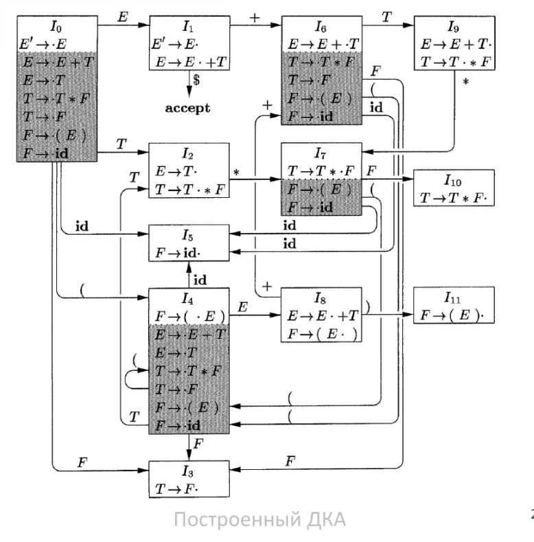
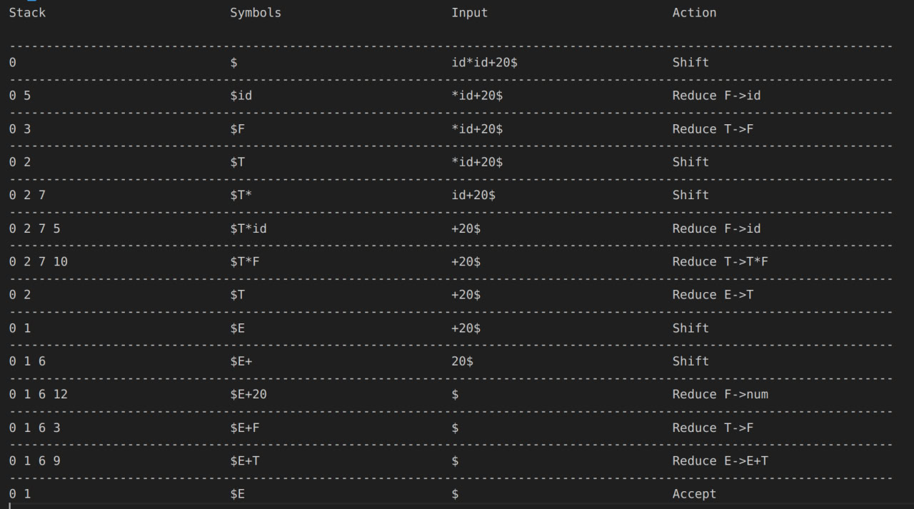
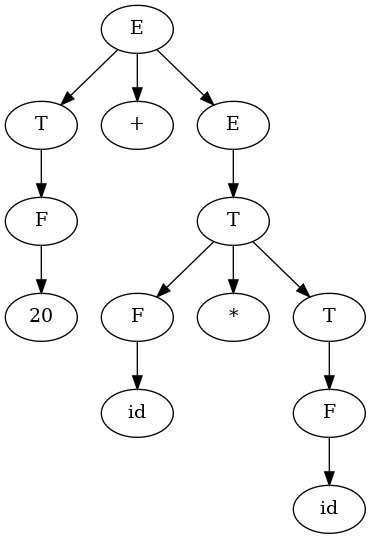

# Shift-Reduce-parser

The arithmetic language consists of addition, subtraction, multiplication, division and brackets. Operations can be performed on variables or on numbers. The name of the variables is specified by a regular expression described in lexer.l

## Grammar
- E -> E + T | E - T | T
- T -> T * F | T / F | F
- F -> (E) | id | num


Expression grammar belongs to the class of LR grammars, which are suitable for bottom-up parsing. It cannot be used for top-down parsing due to its left-recursiveness.

## Shift/Reduce syntactic analysis 

Shift/Reduce parsing is a type of bottom-up analysis in which a stack is used to store grammar characters, and an input buffer is used to store the remaining unanalyzed part of the input string.

Initially, the stack is empty, and the input buffer contains the entire sequence of tokens. During the processing of the input string, characters are transferred onto the stack until it is possible to reduce the string of grammar characters at the top of the stack. The decision to reduce or shift is made according to the current state. This will be discussed later. The parser repeats this cycle until an error is detected or until the stack contains only the start character and the input buffer is empty. 

The result of the parser is a ```parse tree```. Its nodes are the grammar's nonterminals, and its leaves are the tokens themselves.

## LR(0) Item DFA 

A deterministic finite automaton used to make decisions during parsing. In particular, each state of an LR(0) automaton is a set of points in the standard.



For implementation it is used ```Action table``` и ```Goto table```.

**Action table**:
The action table determines the parser's actions (shift, reduce, accept, or error) based on the current state and the symbol on the top of the stack.

**Goto table**:
The goto table defines the new state the parser should transition to after performing a reduce operation, based on the current state and the symbol to which the reduction was applied.

## Example

For input expression ```id * id + 20``` this log output of the parser



and the following ```parse tree``` is visualized




## Dependencies
1. g++
2. CMake 3.10 version (or higher)
3. GTest (for testing)
4. Flex
5. Graphviz (for tree visualization)

## Compiling 

### Parser

To get the parser library and test executables

``` cmd
$ mkdir build
$ cmake -B build -DCMAKE_BUILD_TYPE=Release -DPRINT_TABLE=ON -DDUMP_TREE=ON 
$ cmake --build build/
```

```-DPRINT_TABLE``` option is needed to get a log with a table. ```-DDUMP_TREE``` option is needed to get a dot file. 

## Run the program:

### Parser

To run the parser, you need to pass the input file and dot file

``` cmd
$ ./build/Release/bin/parser <input_file> <dot_file> 

```

If you need to visualize the tree, use 

``` cmd
dot -Tpng <dot_file> -o file.png
```

### Test:

to run table tests

``` cmd
$ ./build/tests/UnitTestTable
```

to run tree tests

``` cmd
$ ./build/tests/UnitTestTree
```

## Useful links

[Habr (LR-parsers)](https://habr.com/ru/companies/otus/articles/819841/)

[MSU Faculty of Mechanics and Mathematics](http://mech.math.msu.su/~vvb/BMSTU/lectLR.html)
